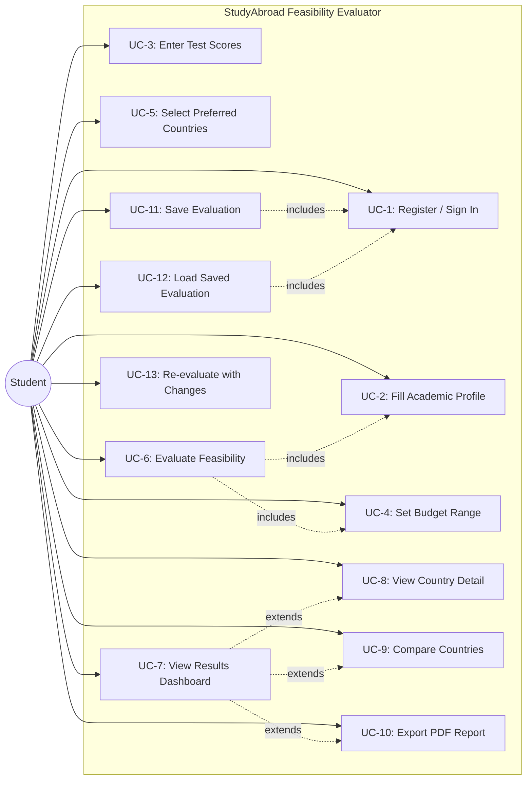
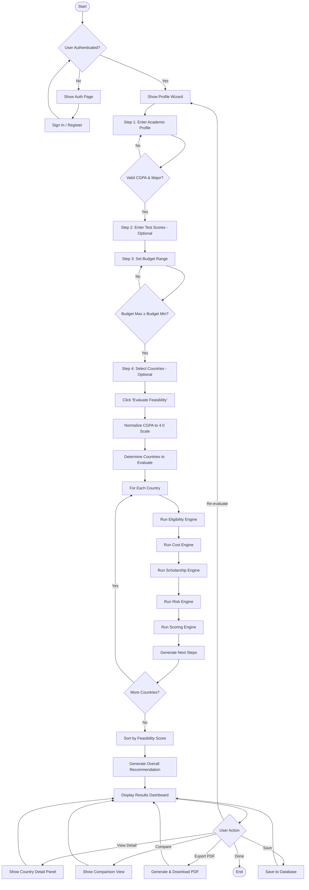
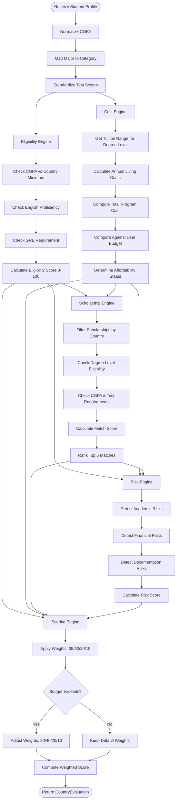
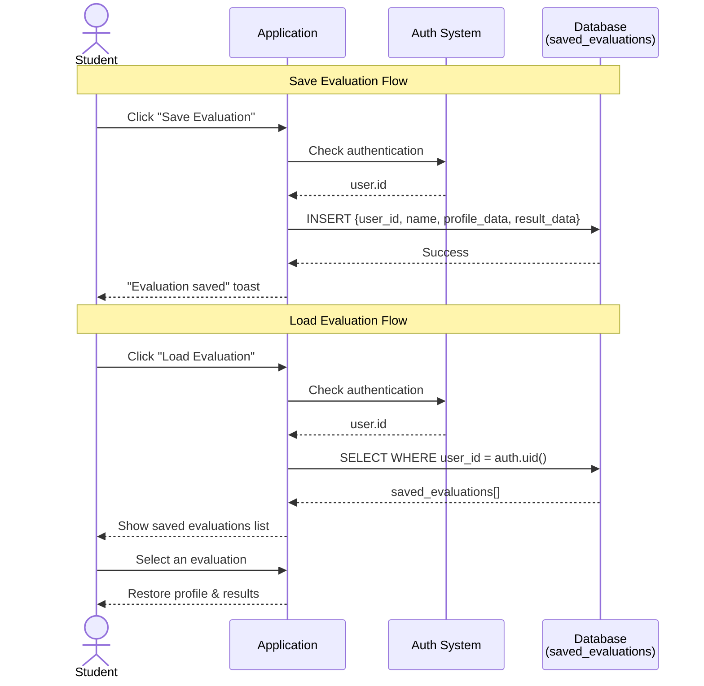
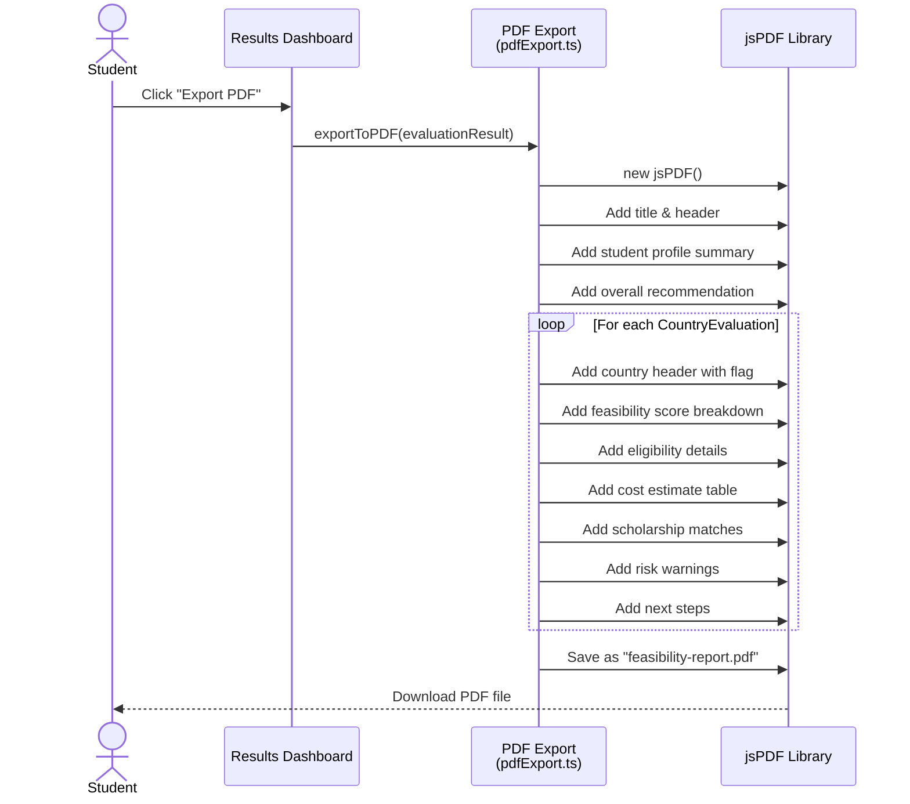

# SOFTWARE PROJECT REPORT

---

## FRONT PAGES

---

### 1. Project Title

**StudyAbroad Feasibility Evaluator: A Deterministic Decision-Support System for Bangladeshi Students Pursuing Higher Education in Europe**

---

### 2. Course Information

| Field | Details |
|---|---|
| **Course Title** | Software Engineering |
| **Course Code** | CSE 412 |
| **Semester** | Spring 2026 |
| **Section** | *(To be filled by student)* |
| **Group** | *(To be filled by student)* |

---

### 3. Submitted To / Submitted By

**Submitted To:**
*(Instructor name, designation, and department — to be filled by student)*

**Submitted By:**
*(Student name(s), ID(s), and department — to be filled by student)*

---

### 4. Team Contribution Table

| Name | Role | Contribution % |
|---|---|---|
| *(Member 1)* | Full-Stack Developer & System Architect | 40% |
| *(Member 2)* | Frontend Developer & UI/UX Designer | 30% |
| *(Member 3)* | Data Engineer & QA/Testing Lead | 30% |

*Note: Adjust names, roles, and percentages as applicable.*

---

### 5. Letter of Transmittal

---

**Date:** February 10, 2026

**To:**
*(Instructor Name)*
*(Designation)*
Department of Computer Science and Engineering
*(University Name)*

**Subject:** Submission of Software Engineering Project Report — StudyAbroad Feasibility Evaluator

Dear Sir/Madam,

We respectfully submit this project report entitled **"StudyAbroad Feasibility Evaluator: A Deterministic Decision-Support System for Bangladeshi Students Pursuing Higher Education in Europe"** as partial fulfillment of the requirements for the course **CSE 412 – Software Engineering**, Spring 2026.

This report documents the complete software engineering lifecycle of our web-based application, covering requirements analysis, system design, architecture, and implementation. The system assists Bangladeshi students in evaluating the feasibility of studying abroad in five European countries through a rule-based, transparent scoring methodology.

We earnestly hope this report meets the expected academic and professional standards. We remain available for any clarification or demonstration as required.

Sincerely,

*(Team member names and IDs)*

---

### 6. Acknowledgement

We express our sincere gratitude to our course instructor for providing invaluable guidance throughout the development of this project. We also acknowledge the open-source communities behind React, Supabase, Tailwind CSS, and shadcn/ui, whose tools and frameworks made this project possible. Additionally, we thank the official portals of DAAD, Study in Finland, Swedish Institute, Nuffic, and Study in Italy for providing publicly available scholarship and admission data that form the backbone of our evaluation engine. Finally, we are grateful to our peers who participated in early testing and provided constructive feedback on the system's usability.

---

### 7. Abstract

Bangladeshi students aspiring to pursue higher education in Europe face a fragmented information landscape—scattered across multiple portals, scholarship databases, and country-specific admission requirements. This project addresses that problem by developing **StudyAbroad Feasibility Evaluator**, a deterministic, rule-based web application that produces a comprehensive 0–100 feasibility score for each target country.

The system accepts a student's academic profile (CGPA, degree level, test scores), financial budget, and country preferences through a guided wizard interface. It then orchestrates five specialized engines—**Academic Eligibility**, **Cost Estimation**, **Scholarship Matching**, **Risk Detection**, and **Feasibility Scoring**—to produce a transparent, reproducible evaluation. The scoring methodology uses weighted components: Academic (35%), Financial (30%), Scholarship (20%), and Risk (15%).

Built on **React 18**, **TypeScript**, **Tailwind CSS**, and **Supabase** (PostgreSQL + Auth), the platform supports user authentication (email/password and Google OAuth), persistent evaluation storage, side-by-side country comparison, and PDF report export. The system currently covers five European countries (Germany, Finland, Sweden, Netherlands, Italy) with 10+ curated scholarships, and is architecturally designed to scale to 15+ countries.

Unlike AI-prediction tools, the system relies exclusively on curated, static datasets and transparent rules—ensuring reproducibility and trustworthiness for academic and personal decision-making.

---

## CHAPTER 1: INTRODUCTION

---

### 1.1 Project Overview (as User Story)

> *As a Bangladeshi student planning to study abroad in Europe, I want to input my academic credentials (CGPA, degree level, IELTS/TOEFL/GRE scores), my financial budget, and my preferred destination countries, so that the system can evaluate my eligibility, estimate total costs, match me with relevant scholarships, detect risks in my profile, and generate a composite feasibility score for each country—allowing me to make an informed decision about where to apply.*

> *As a returning user, I want to sign in with my email or Google account and access my previously saved evaluations, so I can track how my profile improvements affect my feasibility scores over time.*

> *As a user comparing multiple destinations, I want to select up to three countries side-by-side and compare their eligibility, cost, scholarship, and risk metrics visually, so I can identify the best-fit country at a glance.*

> *As a user ready to act on my results, I want to download a detailed PDF report of my feasibility evaluation to share with my family, counselors, or use for personal reference.*

---

### 1.2 Purpose and Scope

**Purpose:**
The purpose of this system is to provide Bangladeshi students with a centralized, data-driven, and transparent tool to assess the feasibility of pursuing undergraduate, Master's, or PhD studies in European countries. It eliminates the need to manually research and cross-reference scattered information by consolidating eligibility requirements, tuition/living costs, scholarship databases, and risk factors into a single evaluation pipeline.

**Scope:**

The system encompasses the following functional boundaries:

| In Scope | Out of Scope |
|---|---|
| Academic eligibility evaluation (CGPA, English proficiency, GRE) | University-specific admission decisions |
| Cost estimation (tuition + living costs per country) | Visa application processing |
| Scholarship matching with eligibility assessment | Real-time web scraping of external portals |
| Risk detection across academic, financial, eligibility, and documentation categories | AI/ML-based predictive modeling |
| Composite feasibility scoring (0–100) | Application form submission |
| Country comparison (up to 3 countries) | Post-admission services (housing, travel) |
| PDF report generation | Counselor/agent booking |
| User authentication and evaluation persistence | Mobile native application |
| 5 European countries (Germany, Finland, Sweden, Netherlands, Italy) | Countries outside the initial 5 |

---

### 1.3 Stakeholders

**Primary Stakeholders:**

| Stakeholder | Description |
|---|---|
| **Bangladeshi Students** | The direct end-users of the platform. They input their academic and financial profiles and receive actionable feasibility evaluations. They benefit from reduced information asymmetry and data-driven decision support. |
| **Project Development Team** | Responsible for designing, implementing, testing, and maintaining the system. They ensure the accuracy of evaluation rules and the reliability of the platform. |

**Secondary Stakeholders:**

| Stakeholder | Description |
|---|---|
| **Education Counselors / Advisors** | May use the generated PDF reports as supplementary material when advising students. The transparent scoring methodology supports evidence-based counseling. |
| **University Admission Offices** | Indirectly benefit as better-informed applicants submit more targeted applications, potentially reducing mismatched applications. |
| **Parents / Guardians** | Use the cost estimates, budget analysis, and risk reports to understand financial commitments and make informed family decisions. |
| **Scholarship Providers (e.g., DAAD, SI, Nuffic)** | Benefit from increased awareness and more qualified applicants being directed to their programs through the scholarship matching engine. |
| **Academic Supervisors / Course Instructors** | Evaluate the project as an academic deliverable demonstrating software engineering principles, system design, and full-stack development competencies. |

---

### 1.4 Technology Stack

| Layer | Technology | Purpose |
|---|---|---|
| **Frontend Framework** | React 18 with TypeScript | Component-based SPA with type safety |
| **Build Tool** | Vite | Fast development server and optimized production builds |
| **Styling** | Tailwind CSS + tailwindcss-animate | Utility-first CSS framework with animation support |
| **UI Component Library** | shadcn/ui (Radix UI primitives) | Accessible, customizable component system |
| **Animation** | Framer Motion | Declarative animations and page transitions |
| **State Management** | React useState/useContext + TanStack React Query | Local state and server-state caching |
| **Routing** | React Router DOM v6 | Client-side routing with protected routes |
| **Form Validation** | Zod + React Hook Form | Schema-based input validation |
| **Database** | PostgreSQL (via Supabase) | Relational storage for user profiles and saved evaluations |
| **Authentication** | Supabase Auth + Google OAuth | Email/password signup with OTP verification, Google OAuth |
| **Backend Functions** | Supabase Edge Functions (Deno) | Serverless backend logic |
| **PDF Generation** | jsPDF + jspdf-autotable | Client-side PDF report export |
| **Testing** | Vitest | Unit and integration testing framework |
| **Deployment** | Lovable Cloud (Vercel-compatible export) | Automated preview deployments with portability |
| **Version Control** | Git | Source code management |

---

## CHAPTER 2: SOFTWARE REQUIREMENTS SPECIFICATION & ANALYSIS

---

### 2.1 Stakeholder Needs & Analysis

**Primary Stakeholder Needs (Bangladeshi Students):**

| Need | Description | Priority |
|---|---|---|
| N1 | Understand academic eligibility for target countries without researching each country manually | High |
| N2 | Get a realistic estimate of total costs (tuition + living) compared against personal budget | High |
| N3 | Discover relevant scholarships and understand match likelihood | High |
| N4 | Identify weaknesses or risks in their profile before applying | Medium |
| N5 | Receive a single, easy-to-understand feasibility score per country | High |
| N6 | Compare multiple countries side-by-side | Medium |
| N7 | Save and revisit evaluations over time | Medium |
| N8 | Download a professional report for offline use or sharing | Low |
| N9 | Authenticate securely to protect personal data | High |

**Secondary Stakeholder Needs:**

| Stakeholder | Need |
|---|---|
| Education Counselors | Access to downloadable PDF reports with transparent scoring breakdowns |
| Parents/Guardians | Clear financial summaries showing budget gaps and scholarship potential |
| Course Instructors | Well-documented, maintainable codebase demonstrating SE principles |

**Requirement Elicitation Methods:**

| Method | Description |
|---|---|
| **Domain Analysis** | Study of official portals (DAAD, Study in Finland, SI, Nuffic, Study in Italy) to extract admission requirements, tuition ranges, living costs, and scholarship criteria |
| **User Story Mapping** | Identification of end-user journeys from profile input through evaluation to decision-making |
| **Competitive Analysis** | Review of existing tools (university-specific calculators, generic study-abroad websites) to identify feature gaps and differentiation opportunities |
| **Iterative Prototyping** | Progressive refinement of the wizard interface and results dashboard based on usability feedback |

---

### 2.2 List of Requirements

#### Functional Requirements (FRs)

| ID | Requirement | Description |
|---|---|---|
| FR-01 | **Profile Input Wizard** | The system shall provide a multi-step wizard (4 steps: Academic, Test Scores, Budget, Destinations) to collect student profile data including degree level, major, CGPA (with scale normalization), IELTS/TOEFL/GRE scores, budget range, and preferred countries. |
| FR-02 | **CGPA Normalization** | The system shall normalize CGPA inputs from 4.0, 5.0, or 10.0 scales to a standard 4.0 scale for consistent evaluation. |
| FR-03 | **Academic Eligibility Evaluation** | The system shall assess eligibility per country by comparing normalized CGPA against country-specific thresholds, checking English proficiency scores against minimum requirements, and evaluating GRE scores where applicable. |
| FR-04 | **Cost Estimation** | The system shall calculate estimated tuition per year, living costs per year, total program cost, and compare against the user's stated budget to determine affordability status (affordable / tight / exceeds-budget). |
| FR-05 | **Scholarship Matching** | The system shall match the student's profile against a curated database of 10+ scholarships, returning the top 5 matches per country with eligibility status, match score, match reasons, and missing requirements. |
| FR-06 | **Risk Detection** | The system shall identify risks across four categories (academic, financial, eligibility, documentation) with severity levels (high/medium/low) and provide specific mitigation recommendations. |
| FR-07 | **Feasibility Scoring** | The system shall compute a weighted composite score (0–100) per country using: Academic (35%), Financial (30%), Scholarship (20%), Risk (15%), with dynamic weight adjustment when budget exceeds costs. |
| FR-08 | **Results Dashboard** | The system shall display summary statistics (average feasibility, budget-friendly count, total scholarships found, high-risk count), a top recommendation with score ring visualization, and individual country cards. |
| FR-09 | **Country Detail Panel** | The system shall provide a slide-out panel showing detailed eligibility breakdown, cost estimates, matched scholarships, identified risks, and actionable next steps for each country. |
| FR-10 | **Country Comparison** | The system shall allow users to select 2–3 countries for side-by-side comparison across eligibility, cost, scholarship, and risk dimensions. |
| FR-11 | **PDF Report Export** | The system shall generate a downloadable PDF containing the complete feasibility evaluation including profile summary, country scores, cost breakdowns, scholarship matches, and recommendations. |
| FR-12 | **User Authentication** | The system shall support email/password registration with 6-digit OTP email verification, email/password login, and Google OAuth sign-in. |
| FR-13 | **Evaluation Persistence** | The system shall auto-save evaluation results for authenticated users and allow retrieval and deletion of saved evaluations from a dashboard panel. |
| FR-14 | **Overall Recommendation** | The system shall generate a textual recommendation based on the top-scoring country's feasibility level (Excellent ≥75%, Good ≥55%, Moderate ≥40%, Challenging <40%). |

#### Non-Functional Requirements (NFRs)

| ID | Category | Requirement |
|---|---|---|
| NFR-01 | **Performance** | The evaluation engine shall compute feasibility scores for all 5 countries in under 500ms on the client side, as all logic is deterministic and runs locally without network calls. |
| NFR-02 | **Usability** | The wizard interface shall require no more than 4 steps to complete profile input, with form validation and clear progress indication via a stepper component. |
| NFR-03 | **Responsiveness** | The application shall be fully responsive across desktop (1920px), tablet (768px), and mobile (375px) viewports using Tailwind CSS responsive utilities. |
| NFR-04 | **Security** | User data shall be protected via Supabase Row-Level Security (RLS) policies ensuring users can only access their own profiles and saved evaluations. Passwords are managed by Supabase Auth with bcrypt hashing. |
| NFR-05 | **Reliability** | The system shall produce identical outputs for identical inputs (deterministic evaluation), with no reliance on AI-generated predictions or non-reproducible external data. |
| NFR-06 | **Maintainability** | The codebase shall follow modular architecture with separate engine modules (eligibility, cost, scholarship, risk, scoring, links) orchestrated by a central index, enabling independent updates. |
| NFR-07 | **Scalability** | The country and scholarship data architecture shall support expansion to 15+ countries by adding entries to static data files without modifying engine logic. |
| NFR-08 | **Portability** | The application shall be deployable on any standard hosting platform (Vercel, Netlify) via environment variable configuration, independent of the original development platform. |
| NFR-09 | **Accessibility** | UI components shall use Radix UI primitives (via shadcn/ui) which provide WAI-ARIA compliant keyboard navigation, focus management, and screen reader support. |
| NFR-10 | **Data Integrity** | All scholarship and country data shall be sourced from official government and institutional portals, with no crowd-sourced or scraped data, ensuring accuracy and trustworthiness. |

#### Extra-Ordinary Requirements (Innovative Features)

| ID | Feature | Description |
|---|---|---|
| EX-01 | **Multi-Engine Orchestration** | The system employs a pipeline architecture where six independent engines (Profile Normalization → Eligibility → Cost → Scholarship → Risk → Scoring) are orchestrated sequentially, each receiving outputs from prior stages. This modular design allows individual engine replacement or enhancement without affecting the overall pipeline. |
| EX-02 | **Dynamic Weight Adjustment** | The feasibility scoring engine dynamically adjusts component weights based on the user's financial situation—increasing the financial weight from 30% to 40% when costs exceed the user's budget, ensuring the score accurately reflects financial constraints. |
| EX-03 | **Transparent Scoring with Breakdown** | Unlike opaque AI-based recommendation systems, every score is decomposable into its four weighted components (academic, financial, scholarship, risk), each with human-readable justifications (✓/⚠/✗ indicators), enabling users to understand exactly why they received a particular score. |
| EX-04 | **Risk Mitigation Guidance** | Beyond simply identifying risks, the system provides specific, actionable mitigation strategies for each detected risk (e.g., "Target IELTS 6.5+" for missing English scores, "Apply to multiple scholarships and have backup plans" for scholarship dependency). |
| EX-05 | **Client-Side PDF Generation** | The system generates comprehensive PDF reports entirely on the client side using jsPDF, requiring no server-side processing, preserving user privacy, and enabling offline report generation. |

---

### 2.3 House of Quality (Quality Function Deployment)

The House of Quality (HoQ) matrix translates stakeholder needs into measurable technical requirements, establishing traceability between *what* users want and *how* the system delivers it.

---

#### 2.3.1 Customer Requirements (WHATs)

Derived from stakeholder needs analysis (Section 2.1):

| ID | Customer Requirement | Importance (1–5) |
|---|---|---|
| CR-1 | Understand eligibility without manual research | 5 |
| CR-2 | Get realistic cost estimates vs. personal budget | 5 |
| CR-3 | Discover relevant scholarships with match likelihood | 5 |
| CR-4 | Identify profile weaknesses before applying | 4 |
| CR-5 | Receive a single, clear feasibility score per country | 5 |
| CR-6 | Compare multiple countries side-by-side | 3 |
| CR-7 | Save and revisit evaluations over time | 3 |
| CR-8 | Download a professional report for offline use | 2 |
| CR-9 | Secure authentication to protect personal data | 5 |

---

#### 2.3.2 Technical Requirements (HOWs)

| ID | Technical Requirement | Unit / Metric |
|---|---|---|
| TR-1 | Academic Eligibility Engine (rule-based CGPA + test score evaluation) | Pass/Fail per criterion |
| TR-2 | CGPA Normalization Module (4.0 / 5.0 / 10.0 → standard 4.0) | Normalized GPA (0–4.0) |
| TR-3 | Cost Estimation Engine (tuition + living cost calculation) | USD per year |
| TR-4 | Scholarship Matching Engine (profile-to-scholarship scoring) | Match score (0–100) |
| TR-5 | Risk Detection Engine (4-category risk identification) | Risk count & severity |
| TR-6 | Weighted Feasibility Scoring Engine (composite 0–100 score) | Score (0–100) |
| TR-7 | Multi-step Wizard UI (4-step guided input) | Steps to complete (≤4) |
| TR-8 | Country Comparison View (side-by-side tabular display) | Countries compared (2–3) |
| TR-9 | Persistent Storage via PostgreSQL + RLS | CRUD latency (ms) |
| TR-10 | Client-side PDF Generation (jsPDF) | File size (KB) |
| TR-11 | Supabase Auth (email/password + Google OAuth) | Auth methods supported |
| TR-12 | Responsive UI (Tailwind CSS + shadcn/ui) | Breakpoints supported |

---

#### 2.3.3 Relationship Matrix (WHATs vs. HOWs)

Legend: **◉** = Strong (9) | **○** = Moderate (3) | **△** = Weak (1) | *(blank)* = None

| | TR-1 | TR-2 | TR-3 | TR-4 | TR-5 | TR-6 | TR-7 | TR-8 | TR-9 | TR-10 | TR-11 | TR-12 |
|---|---|---|---|---|---|---|---|---|---|---|---|---|
| **CR-1** Eligibility understanding | ◉ | ◉ | | | | ○ | ○ | | | | | |
| **CR-2** Cost estimates vs. budget | | | ◉ | | △ | ○ | ○ | | | | | |
| **CR-3** Scholarship discovery | | | | ◉ | | ○ | △ | | | | | |
| **CR-4** Profile weakness detection | ◉ | △ | | | ◉ | ○ | | | | | | |
| **CR-5** Clear feasibility score | ○ | ○ | ○ | ○ | ○ | ◉ | | | | | | |
| **CR-6** Country comparison | | | ○ | ○ | ○ | ○ | | ◉ | | | | |
| **CR-7** Save/revisit evaluations | | | | | | | | | ◉ | | ○ | |
| **CR-8** Downloadable report | | | | | | ○ | | | △ | ◉ | | |
| **CR-9** Secure authentication | | | | | | | | | ○ | | ◉ | |

---

#### 2.3.4 Technical Correlations (Roof Matrix)

The roof of the HoQ identifies synergies (+) and conflicts (−) between technical requirements:

| Correlation | Relationship | Explanation |
|---|---|---|
| TR-1 ↔ TR-2 | **Strong +** | CGPA normalization is a prerequisite for eligibility evaluation |
| TR-1 ↔ TR-6 | **Strong +** | Eligibility score feeds directly into feasibility scoring (35% weight) |
| TR-3 ↔ TR-6 | **Strong +** | Cost affordability score is a weighted component (30%) of feasibility |
| TR-4 ↔ TR-6 | **Strong +** | Scholarship score contributes 20% to feasibility |
| TR-5 ↔ TR-6 | **Strong +** | Risk score (inverted) contributes 15% to feasibility |
| TR-6 ↔ TR-8 | **Moderate +** | Feasibility scores are the primary data shown in comparison view |
| TR-9 ↔ TR-11 | **Strong +** | Authentication is required for persistent storage (RLS policies use `auth.uid()`) |
| TR-7 ↔ TR-12 | **Moderate +** | Wizard UI must be responsive across all breakpoints |
| TR-10 ↔ TR-9 | **Weak −** | PDF is generated client-side and does not depend on server storage, but saved data can seed PDF content |

---

#### 2.3.5 Competitive Benchmarking

| Customer Requirement | Our System | Generic Study-Abroad Portals | University Calculators |
|---|---|---|---|
| CR-1 Eligibility understanding | ★★★★★ (automated, multi-country) | ★★★ (manual, per-portal) | ★★★★ (single university) |
| CR-2 Cost estimates | ★★★★★ (budget comparison) | ★★★ (listed, no comparison) | ★★★ (tuition only) |
| CR-3 Scholarship matching | ★★★★ (scored matching) | ★★ (directory listing) | ★★ (university-specific) |
| CR-4 Risk detection | ★★★★★ (4-category analysis) | ★ (none) | ★ (none) |
| CR-5 Feasibility score | ★★★★★ (composite 0–100) | ★ (none) | ★ (none) |
| CR-6 Country comparison | ★★★★ (side-by-side) | ★★ (separate pages) | ✗ (N/A) |
| CR-9 Secure auth | ★★★★★ (OAuth + email) | ★★★ (varies) | ★★★ (varies) |

---

#### 2.3.6 Technical Targets

| Technical Requirement | Target Value |
|---|---|
| TR-1 Eligibility Engine | ≥3 criteria evaluated per country (CGPA, English, GRE) |
| TR-2 CGPA Normalization | Support 3 scales (4.0, 5.0, 10.0) with <0.01 precision loss |
| TR-3 Cost Engine | Estimates within ±15% of official portal figures |
| TR-4 Scholarship Engine | ≥10 scholarships in database, top 5 returned per country |
| TR-5 Risk Engine | Detect risks across 4 categories with 3 severity levels |
| TR-6 Scoring Engine | Weighted score computed in <50ms per country |
| TR-7 Wizard UI | Profile input completed in ≤4 steps |
| TR-8 Comparison View | Support 2–3 country comparison |
| TR-9 Persistent Storage | Save/load evaluation in <500ms |
| TR-10 PDF Generation | Report generated in <2 seconds, file size <500KB |
| TR-11 Authentication | 2 auth methods (email + Google OAuth) |
| TR-12 Responsive UI | 3 breakpoints (mobile 375px, tablet 768px, desktop 1920px) |

---

#### 2.3.7 HoQ Summary Diagram

```
┌─────────────────────────────────────────────────────┐
│                   ROOF (Correlations)                │
│         TR1─TR2(+)  TR1─TR6(+)  TR3─TR6(+)          │
│         TR4─TR6(+)  TR5─TR6(+)  TR9─TR11(+)         │
├────────────┬────────────────────────────────────┬────┤
│            │     Technical Requirements         │    │
│  Customer  │  (HOWs)                            │ Im │
│  Require-  ├──┬──┬──┬──┬──┬──┬──┬──┬──┬───┬───┬─┤ po │
│  ments     │T1│T2│T3│T4│T5│T6│T7│T8│T9│T10│T11│T│ rt │
│  (WHATs)   │  │  │  │  │  │  │  │  │  │   │   │1│ .  │
│            │  │  │  │  │  │  │  │  │  │   │   │2│    │
├────────────┼──┼──┼──┼──┼──┼──┼──┼──┼──┼───┼───┼─┼────┤
│ CR-1       │◉ │◉ │  │  │  │○ │○ │  │  │   │   │ │ 5  │
│ CR-2       │  │  │◉ │  │△ │○ │○ │  │  │   │   │ │ 5  │
│ CR-3       │  │  │  │◉ │  │○ │△ │  │  │   │   │ │ 5  │
│ CR-4       │◉ │△ │  │  │◉ │○ │  │  │  │   │   │ │ 4  │
│ CR-5       │○ │○ │○ │○ │○ │◉ │  │  │  │   │   │ │ 5  │
│ CR-6       │  │  │○ │○ │○ │○ │  │◉ │  │   │   │ │ 3  │
│ CR-7       │  │  │  │  │  │  │  │  │◉ │   │○  │ │ 3  │
│ CR-8       │  │  │  │  │  │○ │  │  │△ │ ◉ │   │ │ 2  │
│ CR-9       │  │  │  │  │  │  │  │  │○ │   │◉  │ │ 5  │
├────────────┼──┼──┼──┼──┼──┼──┼──┼──┼──┼───┼───┼─┼────┤
│ Absolute   │27│18│24│24│21│42│12│12│18│ 9 │24 │ │    │
│ Weight     │  │  │  │  │  │  │  │  │  │   │   │ │    │
├────────────┼──┼──┼──┼──┼──┼──┼──┼──┼──┼───┼───┼─┼────┤
│ Target     │≥3│3s│±15│≥10│4c│<50│≤4│2-3│<.5│<2s│2 │3 │    │
│ Values     │cr│ca│%  │sch│at│ms │st│cty│sec│   │mt│bp│    │
├────────────┴──┴──┴──┴──┴──┴──┴──┴──┴──┴───┴───┴─┴────┤
│            COMPETITIVE BENCHMARKING                    │
│  Our System:  ★★★★★ in CR-1,2,4,5,9                   │
│  Competitors: ★★-★★★ (no scoring/risk features)       │
└────────────────────────────────────────────────────────┘
```

---

---

## 2.4 Use Case Diagram

The Use Case Diagram captures all primary interactions between the **Student (Actor)** and the StudyAbroad Feasibility Evaluator system.

### 2.4.1 Actors

| Actor | Description |
|---|---|
| **Student** | Primary user — a Bangladeshi student exploring study-abroad options |
| **System (Evaluation Engine)** | Internal actor — the deterministic pipeline that processes evaluations |

### 2.4.2 Use Cases

| ID | Use Case | Description |
|---|---|---|
| UC-1 | Register / Sign In | Authenticate via Google OAuth or email/password |
| UC-2 | Fill Academic Profile | Enter degree level, major, CGPA, and CGPA scale |
| UC-3 | Enter Test Scores | Optionally provide IELTS, TOEFL, and GRE scores |
| UC-4 | Set Budget Range | Define minimum and maximum annual budget (EUR) |
| UC-5 | Select Preferred Countries | Choose target countries or leave blank for all |
| UC-6 | Evaluate Feasibility | Trigger the deterministic evaluation pipeline |
| UC-7 | View Results Dashboard | Browse ranked country cards with feasibility scores |
| UC-8 | View Country Detail | Inspect eligibility, costs, scholarships, and risks for one country |
| UC-9 | Compare Countries | Side-by-side comparison of two or more countries |
| UC-10 | Export PDF Report | Download a formatted PDF of the evaluation results |
| UC-11 | Save Evaluation | Persist evaluation results to the database |
| UC-12 | Load Saved Evaluation | Retrieve and view a previously saved evaluation |
| UC-13 | Re-evaluate with Changes | Modify profile inputs and re-run the evaluation |

### 2.4.3 Use Case Diagram (Mermaid)



### 2.4.4 Use Case Descriptions (Selected)

#### UC-6: Evaluate Feasibility

| Field | Detail |
|---|---|
| **Primary Actor** | Student |
| **Preconditions** | Academic profile (Step 1) and budget (Step 3) are filled |
| **Main Flow** | 1. Student clicks "Evaluate Feasibility" on Step 4 of the wizard |
|  | 2. System normalizes CGPA to 4.0 scale via `profileNormalization.ts` |
|  | 3. System runs `eligibilityEngine` for each selected country |
|  | 4. System runs `costEngine` to estimate tuition + living costs |
|  | 5. System runs `scholarshipEngine` to match eligible scholarships |
|  | 6. System runs `riskEngine` to detect academic/financial/documentation risks |
|  | 7. System runs `scoringEngine` to compute weighted feasibility score |
|  | 8. System runs `linksEngine` to generate next-step action items |
|  | 9. Results are sorted by overall score and displayed on the dashboard |
| **Postconditions** | Student sees ranked country evaluations with scores |
| **Alternative Flow** | If no countries are selected, all 5 countries are evaluated |

#### UC-10: Export PDF Report

| Field | Detail |
|---|---|
| **Primary Actor** | Student |
| **Preconditions** | An evaluation has been completed |
| **Main Flow** | 1. Student clicks "Export PDF" from the results dashboard |
|  | 2. System generates a PDF using `jsPDF` with all evaluation data |
|  | 3. PDF is downloaded to the student's device |
| **Postconditions** | Student has a downloadable PDF report |

---

## 2.5 Activity Diagram

The Activity Diagram models the end-to-end workflow from user input to evaluation output.

### 2.5.1 Main Evaluation Flow



### 2.5.2 Evaluation Engine Internal Flow



---

## 2.6 Sequence Diagram

The Sequence Diagram shows the interaction between components during the evaluation process.

### 2.6.1 Main Evaluation Sequence

```mermaid
sequenceDiagram
    actor Student
    participant Wizard as ProfileWizard
    participant Index as Index Page
    participant Orch as Orchestrator<br/>(engines/index.ts)
    participant Norm as Profile<br/>Normalization
    participant Elig as Eligibility<br/>Engine
    participant Cost as Cost<br/>Engine
    participant Schol as Scholarship<br/>Engine
    participant Risk as Risk<br/>Engine
    participant Score as Scoring<br/>Engine
    participant Links as Links<br/>Engine
    participant Dash as Results<br/>Dashboard

    Student->>Wizard: Fill 4-step profile form
    Student->>Wizard: Click "Evaluate Feasibility"
    Wizard->>Index: onComplete(StudentProfile)
    Index->>Orch: evaluateAllCountries(profile)

    Orch->>Orch: Filter countries (preferred or all)

    loop For each Country
        Orch->>Norm: normalizeCGPA(cgpa, scale)
        Norm-->>Orch: normalizedCGPA (4.0 scale)

        Orch->>Elig: evaluateAcademicEligibility(profile, country)
        Elig-->>Orch: EligibilityResult {status, score, reasons}

        Orch->>Cost: estimateCosts(profile, country)
        Cost-->>Orch: CostEstimate {tuition, living, affordability}

        Orch->>Schol: getTopScholarshipMatches(profile, scholarships, 5)
        Schol-->>Orch: ScholarshipMatch[] (top 5)

        Orch->>Risk: detectRisks(profile, country, eligibility, cost, scholarships)
        Risk-->>Orch: Risk[]
        Orch->>Risk: calculateRiskScore(risks)
        Risk-->>Orch: riskScore (0-100)

        Orch->>Score: computeFeasibilityScore(profile, country, elig, cost, schol, risk)
        Score-->>Orch: FeasibilityScore {overall, breakdown, weights}

        Orch->>Links: generateNextSteps(profile, country, hasScholarships)
        Links-->>Orch: NextStep[]
    end

    Orch->>Orch: Sort evaluations by score (desc)
    Orch->>Orch: generateOverallRecommendation()
    Orch-->>Index: EvaluationResult

    Index->>Dash: Display results
    Dash-->>Student: Show ranked country cards
```

### 2.6.2 Save & Load Evaluation Sequence



### 2.6.3 PDF Export Sequence



---

## 2.7 Wireframe Sketches (Low-Fidelity)

The following wireframes represent the key screens of the StudyAbroad Feasibility Evaluator in a mobile-first layout.

---

### Screen 1 — Landing / Home Screen

```
┌──────────────────────────┐
│  [Logo]    StudyAbroad    │
│         Feasibility       │
│         Evaluator         │
├──────────────────────────┤
│                          │
│   ┌──────────────────┐   │
│   │                  │   │
│   │   ╲            ╱ │   │
│   │    ╲  Hero    ╱  │   │
│   │     ╲ Image ╱   │   │
│   │      ╲    ╱    │   │
│   │       ╲ ╱     │   │
│   │        ╱╲      │   │
│   │       ╱  ╲     │   │
│   │      ╱    ╲    │   │
│   └──────────────────┘   │
│                          │
│   "Find your best study  │
│    abroad destination"    │
│                          │
│  ┌────────────────────┐  │
│  │ ★ Start Evaluation │  │
│  └────────────────────┘  │
│                          │
│  ┌────────────────────┐  │
│  │ 🔑 Sign In / Up    │  │
│  └────────────────────┘  │
│                          │
│  [⊞ Feature] [⊞ Feature]│
│  [⊞ Feature] [⊞ Feature]│
│                          │
└──────────────────────────┘
         Home Screen
```

---

### Screen 2 — Authentication (Login / Sign Up)

```
┌──────────────────────────┐
│  ← Back                  │
├──────────────────────────┤
│                          │
│       ┌──────────┐       │
│       │  [Logo]  │       │
│       └──────────┘       │
│                          │
│    Welcome Back / Join   │
│                          │
│  ┌────────────────────┐  │
│  │ Email              │  │
│  └────────────────────┘  │
│  ┌────────────────────┐  │
│  │ Password           │  │
│  └────────────────────┘  │
│                          │
│  ┌────────────────────┐  │
│  │    Sign In / Up    │  │
│  └────────────────────┘  │
│                          │
│  ──── OR ────            │
│                          │
│  ┌────────────────────┐  │
│  │ [G] Sign in with   │  │
│  │     Google         │  │
│  └────────────────────┘  │
│                          │
│  Toggle: Login ↔ Sign Up │
│                          │
└──────────────────────────┘
         Login / Sign Up
```

---

### Screen 3 — Wizard Step 1: Academic Profile

```
┌──────────────────────────┐
│  Step ①─②─③─④  [1 of 4] │
│  ●───○───○───○           │
├──────────────────────────┤
│                          │
│  Academic Profile        │
│  "Your education info"   │
│                          │
│  Degree Level            │
│  ┌────────────────────┐  │
│  │ ▼ Master's         │  │
│  └────────────────────┘  │
│                          │
│  Major / Field           │
│  ┌────────────────────┐  │
│  │ e.g. Computer Sci  │  │
│  └────────────────────┘  │
│                          │
│  CGPA        Scale       │
│  ┌─────────┐ ┌────────┐ │
│  │ 3.5     │ │ ▼ /4.0 │ │
│  └─────────┘ └────────┘ │
│                          │
│  ☐ Research Experience   │
│  ☐ Work Experience       │
│  Publications: [0 ▲▼]    │
│                          │
│  [Reset]    [Continue →] │
└──────────────────────────┘
     Wizard — Academic
```

---

### Screen 4 — Wizard Step 2: Test Scores

```
┌──────────────────────────┐
│  Step ①─②─③─④  [2 of 4] │
│  ●───●───○───○           │
├──────────────────────────┤
│                          │
│  Test Scores (Optional)  │
│  "IELTS, TOEFL, GRE"    │
│                          │
│  IELTS Overall           │
│  ┌────────────────────┐  │
│  │ 7.0      ◄━━━━━► │  │
│  └────────────────────┘  │
│                          │
│  TOEFL Total             │
│  ┌────────────────────┐  │
│  │ 100                │  │
│  └────────────────────┘  │
│                          │
│  GRE Scores              │
│  Verbal    Quant   AWA   │
│  ┌──────┐ ┌──────┐ ┌──┐ │
│  │ 155  │ │ 165  │ │4.0│ │
│  └──────┘ └──────┘ └──┘ │
│                          │
│  "All scores optional"   │
│                          │
│  [← Back]   [Continue →] │
└──────────────────────────┘
     Wizard — Test Scores
```

---

### Screen 5 — Wizard Step 3: Budget & Goals

```
┌──────────────────────────┐
│  Step ①─②─③─④  [3 of 4] │
│  ●───●───●───○           │
├──────────────────────────┤
│                          │
│  Budget & Goals          │
│  "Financial planning"    │
│                          │
│  Annual Budget Range     │
│  Min           Max       │
│  ┌─────────┐ ┌─────────┐│
│  │ $20,000 │ │ $50,000 ││
│  └─────────┘ └─────────┘│
│                          │
│  ◄━━━━━━━━━━━━━━━━━━━━► │
│  $5k                $80k │
│                          │
│  Program Preference      │
│  ┌────────────────────┐  │
│  │ ▼ Taught / Research│  │
│  └────────────────────┘  │
│                          │
│                          │
│  [← Back]   [Continue →] │
└──────────────────────────┘
    Wizard — Budget & Goals
```

---

### Screen 6 — Wizard Step 4: Destinations

```
┌──────────────────────────┐
│  Step ①─②─③─④  [4 of 4] │
│  ●───●───●───●           │
├──────────────────────────┤
│                          │
│  Choose Destinations     │
│  "Select countries"      │
│                          │
│  ┌──────┐ ┌──────┐      │
│  │ 🇩🇪   │ │ 🇫🇮   │      │
│  │Germany│ │Finland│      │
│  │  ☑   │ │  ☐   │      │
│  └──────┘ └──────┘      │
│  ┌──────┐ ┌──────┐      │
│  │ 🇸🇪   │ │ 🇳🇱   │      │
│  │Sweden │ │Nether.│      │
│  │  ☑   │ │  ☐   │      │
│  └──────┘ └──────┘      │
│  ┌──────┐               │
│  │ 🇮🇹   │               │
│  │ Italy │               │
│  │  ☐   │               │
│  └──────┘               │
│                          │
│  "Leave empty = all"     │
│                          │
│ [← Back] [★ Evaluate!]  │
└──────────────────────────┘
    Wizard — Destinations
```

---

### Screen 7 — Results Dashboard

```
┌──────────────────────────┐
│  Your Feasibility Report │
│  "Master's in CS"        │
├──────────────────────────┤
│ ┌─────┐┌─────┐┌─────┐┌─────┐│
│ │Avg  ││Budg.││Schol.││Risk ││
│ │ 72% ││3/5  ││ 12  ││ 2  ││
│ └─────┘└─────┘└─────┘└─────┘│
│                          │
│ ┌────────────────────────┐│
│ │ ★ Top: 🇩🇪 Germany 85% ││
│ │ "Strong academic fit…" ││
│ │    ┌──────────┐        ││
│ │    │ ╭──────╮ │ 85%    ││
│ │    │ │ Ring │ │        ││
│ │    │ ╰──────╯ │        ││
│ │    └──────────┘        ││
│ └────────────────────────┘│
│                          │
│ [⇔ Compare Countries]    │
│                          │
│ ┌──────┐ ┌──────┐ ┌──────┐│
│ │🇩🇪    │ │🇫🇮    │ │🇸🇪    ││
│ │85%   │ │78%   │ │74%   ││
│ │██████│ │█████ │ │████  ││
│ └──────┘ └──────┘ └──────┘│
│ ┌──────┐ ┌──────┐        │
│ │🇳🇱    │ │🇮🇹    │        │
│ │71%   │ │68%   │        │
│ │████  │ │███   │        │
│ └──────┘ └──────┘        │
│                          │
│ [↺ New] [⬇ Download PDF] │
└──────────────────────────┘
      Results Dashboard
```

---

### Screen 8 — Country Detail Panel (Slide-over)

```
┌──────────────────────────┐
│  ✕ Close                 │
├──────────────────────────┤
│  🇩🇪 Germany        85%  │
│  ┌──────────────────┐    │
│  │   Score Ring      │    │
│  │   ╭──────╮       │    │
│  │   │  85  │       │    │
│  │   ╰──────╯       │    │
│  └──────────────────┘    │
│                          │
│  Breakdown               │
│  Academic    ████████ 90 │
│  Financial   ██████  75  │
│  Language    ████████ 88 │
│  Visa        ██████  72  │
│                          │
│  ── Scholarships ──      │
│  ┌────────────────────┐  │
│  │ DAAD Scholarship   │  │
│  │ Covers: Tuition    │  │
│  │ Eligibility: ✓     │  │
│  └────────────────────┘  │
│  ┌────────────────────┐  │
│  │ Erasmus Mundus     │  │
│  │ Covers: Full       │  │
│  │ Eligibility: ✓     │  │
│  └────────────────────┘  │
│                          │
│  ── Risks ──             │
│  ⚠ High living cost     │
│  ⚠ Competitive entry    │
│                          │
│  ── Useful Links ──      │
│  🔗 DAAD Portal          │
│  🔗 Uni-Assist            │
│                          │
└──────────────────────────┘
   Country Detail (Panel)
```

---

### Screen 9 — Comparison View (Side-by-Side)

```
┌──────────────────────────────────────┐
│  Compare Countries          ✕ Close │
├────────────┬────────────┬────────────┤
│   🇩🇪       │   🇫🇮       │   🇸🇪       │
│  Germany   │  Finland   │  Sweden    │
│   85%      │   78%      │   74%      │
├────────────┼────────────┼────────────┤
│ Academic   │ Academic   │ Academic   │
│  ████ 90   │  ███ 82    │  ███ 80    │
├────────────┼────────────┼────────────┤
│ Financial  │ Financial  │ Financial  │
│  ███ 75    │  ████ 85   │  ███ 78    │
├────────────┼────────────┼────────────┤
│ Language   │ Language   │ Language   │
│  ████ 88   │  ███ 80    │  ███ 76    │
├────────────┼────────────┼────────────┤
│ Visa       │ Visa       │ Visa       │
│  ███ 72    │  ███ 70    │  ███ 68    │
├────────────┼────────────┼────────────┤
│ Tuition    │ Tuition    │ Tuition    │
│ €1,500/yr  │ €0/yr      │ €0/yr      │
├────────────┼────────────┼────────────┤
│ Living     │ Living     │ Living     │
│ €10k/yr    │ €9k/yr     │ €10k/yr    │
├────────────┼────────────┼────────────┤
│ Schlrshps  │ Schlrshps  │ Schlrshps  │
│    4       │    3       │    2       │
├────────────┼────────────┼────────────┤
│ Risks      │ Risks      │ Risks      │
│  1 high    │  0 high    │  1 high    │
├────────────┴────────────┴────────────┤
│  [⬇ Download Comparison PDF]        │
└──────────────────────────────────────┘
         Comparison View
```

---

### Screen 10 — Saved Evaluations (Authenticated)

```
┌──────────────────────────┐
│  📋 My Saved Reports     │
│                    [+ New]│
├──────────────────────────┤
│                          │
│  ┌────────────────────┐  │
│  │ "Germany Focus"     │  │
│  │ Master's in CS      │  │
│  │ 3 countries • 85%   │  │
│  │ Saved: 15 Jan 2026  │  │
│  │         [View] [🗑] │  │
│  └────────────────────┘  │
│                          │
│  ┌────────────────────┐  │
│  │ "Nordic Options"    │  │
│  │ Master's in DS      │  │
│  │ 2 countries • 76%   │  │
│  │ Saved: 10 Jan 2026  │  │
│  │         [View] [🗑] │  │
│  └────────────────────┘  │
│                          │
│  ┌────────────────────┐  │
│  │ "Budget Friendly"   │  │
│  │ Bachelor's in EE    │  │
│  │ 5 countries • 71%   │  │
│  │ Saved: 02 Jan 2026  │  │
│  │         [View] [🗑] │  │
│  └────────────────────┘  │
│                          │
└──────────────────────────┘
     Saved Evaluations
```

---

*— End of Report (Sections up to 2.7) —*
